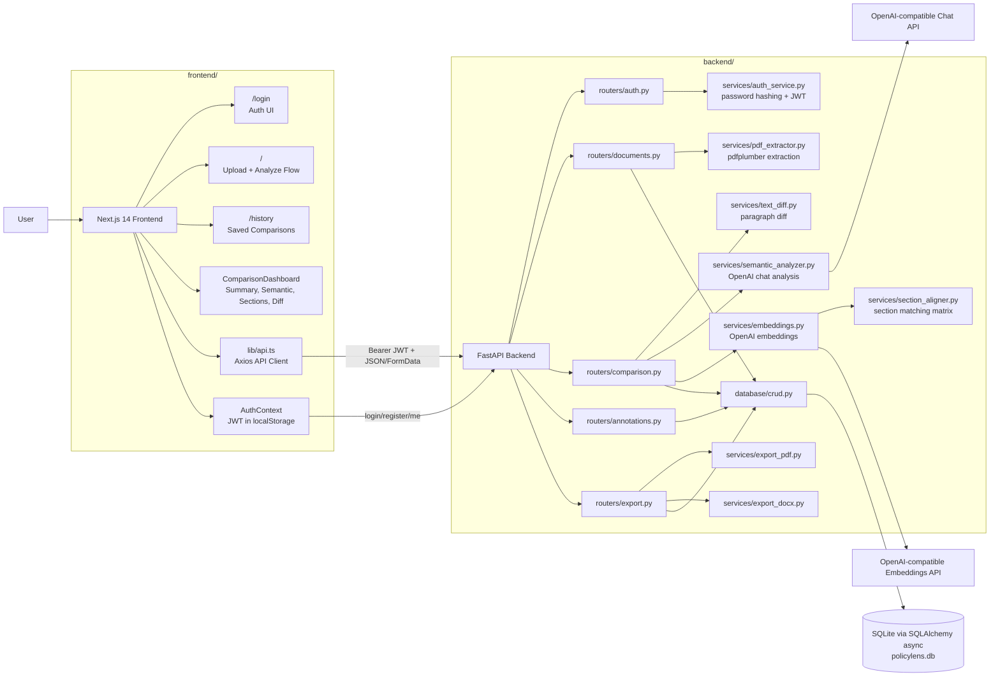

# PolicyLens

AI-assisted policy document comparison for legal, compliance, and operations teams. PolicyLens lets a user upload two PDF policy documents, extracts and compares their text, runs semantic impact analysis, aligns sections with embeddings, and returns an executive dashboard with saved history, annotations, and downloadable PDF/DOCX reports.

## What It Does

- Authenticated user accounts with JWT-based sessions.
- Drag-and-drop PDF upload for a legacy/original document and an updated document.
- PDF text extraction, cleanup, word/page counts, and section heading detection.
- Paragraph-level diffing for additions, deletions, and modifications.
- OpenAI-powered semantic analysis with business, compliance, regulatory impact, recommendations, and executive summary.
- Embedding-based section alignment, structural similarity matrix, and semantic clone detection.
- Interactive Next.js dashboard with executive summary, semantic changes, section analysis, and side-by-side text diff.
- Per-user comparison history with saved results and delete support.
- Reviewer annotations on comparison changes.
- Export of completed comparisons as PDF or DOCX.

## Architecture



## Repository Layout

```text
policylense/
├── backend/
│   ├── main.py                    # FastAPI app, CORS, lifespan, router registration
│   ├── config.py                  # Pydantic settings loaded from backend/.env
│   ├── routers/
│   │   ├── auth.py                # Register, login, current user
│   │   ├── documents.py           # PDF upload and extraction
│   │   ├── comparison.py          # Diff, semantic analysis, section alignment, history
│   │   ├── annotations.py         # Create, list, resolve, delete annotations
│   │   └── export.py              # PDF/DOCX report downloads
│   ├── services/
│   │   ├── auth_service.py        # JWT and password helpers
│   │   ├── pdf_extractor.py       # pdfplumber text extraction
│   │   ├── text_diff.py           # difflib paragraph/line/inline diff helpers
│   │   ├── semantic_analyzer.py   # OpenAI semantic/compliance analysis
│   │   ├── embeddings.py          # Batched embedding calls and cosine similarity
│   │   ├── section_aligner.py     # Section splitting, matching, similarity matrix
│   │   ├── export_pdf.py          # ReportLab PDF generation
│   │   └── export_docx.py         # python-docx report generation
│   ├── database/
│   │   ├── connection.py          # Async SQLAlchemy engine/session setup
│   │   ├── models.py              # User, document, comparison, annotation tables
│   │   └── crud.py                # Persistence helpers
│   ├── models/schemas.py          # Pydantic request/response models
│   ├── requirements.txt
│   └── Dockerfile
├── frontend/
│   ├── app/
│   │   ├── page.tsx               # Protected upload/analyze/results flow
│   │   ├── login/page.tsx         # Sign in and registration screen
│   │   ├── history/page.tsx       # Saved comparison list and reopen/delete
│   │   ├── layout.tsx             # App shell and providers
│   │   └── globals.css            # Tailwind theme styles
│   ├── components/                # Dashboard, diff, summary, annotations, upload UI
│   ├── context/AuthContext.tsx    # Client-side auth state and route guard
│   ├── lib/api.ts                 # Typed backend API functions
│   ├── types/index.ts             # Frontend TypeScript API types
│   ├── package.json
│   └── Dockerfile
├── docker-compose.yml
└── README.md
```

## Data Flow

1. A user registers or logs in through `/login`; the frontend stores the JWT as `pl_token`.
2. The user uploads two PDFs from `/`; each upload calls `POST /api/documents/upload`.
3. The backend extracts text with `pdfplumber`, detects sections, stores the document, and returns a `file_id`.
4. The frontend calls `POST /api/comparison/analyze` with both document IDs.
5. The backend computes paragraph diffs, sends prioritized changes to the chat model, generates an executive summary, embeds sections, aligns section pairs, and saves the comparison for the authenticated user.
6. The dashboard displays summary metrics, semantic changes, section analysis, similarity data, and raw text diff.
7. Users can reopen comparisons from `/history`, add/resolve/delete annotations, or export reports as PDF/DOCX.

## Tech Stack

| Layer | Technology |
| --- | --- |
| Frontend | Next.js 14, React 18, TypeScript, Tailwind CSS, Framer Motion |
| Frontend API | Axios with bearer-token interceptor |
| UI Components | lucide-react icons, react-dropzone, react-diff-viewer-continued |
| Backend | FastAPI, Python 3.11, Uvicorn |
| Persistence | SQLite, SQLAlchemy async, aiosqlite |
| Auth | JWT with `python-jose`, Argon2 password hashing via `pwdlib[argon2]` |
| PDF Parsing | pdfplumber |
| Diff Engine | Python `difflib` |
| AI Analysis | OpenAI-compatible chat completions API |
| Embeddings | OpenAI-compatible embeddings API, NumPy cosine similarity |
| Exports | ReportLab PDF, python-docx DOCX |

## Prerequisites

- Python 3.11+
- Node.js 18+ or 20+
- npm
- An OpenAI-compatible chat model and embedding model/API key

## Environment Variables

Create `backend/.env`:

```env
OPENAI_BASE_URL=https://api.openai.com/v1
OPENAI_API_KEY=your_chat_api_key
OPENAI_MODEL=gpt-4o

OPENAI_EMBEDDING_BASE_URL=https://api.openai.com/v1
OPENAI_EMBEDDING_API_KEY=your_embedding_api_key
OPENAI_EMBEDDING_MODEL=text-embedding-3-small

MAX_TOKENS=4000
CORS_ORIGINS=http://localhost:3000
DATABASE_URL=sqlite+aiosqlite:///./policylens.db

JWT_SECRET=replace-with-a-long-random-secret
JWT_ALGORITHM=HS256
JWT_EXPIRE_MINUTES=1440
```

Create `frontend/.env.local` if the backend is not running at the default URL:

```env
NEXT_PUBLIC_API_URL=http://localhost:8000
```

## Local Development

### Backend

```bash
cd backend
python -m venv venv
source venv/bin/activate
pip install -r requirements.txt
python main.py
```

Backend URLs:

- API: `http://localhost:8000`
- Swagger docs: `http://localhost:8000/docs`
- Health check: `http://localhost:8000/health`

### Frontend

```bash
cd frontend
npm install
npm run dev
```

Frontend URL:

- App: `http://localhost:3000`

## Docker Compose

The repository includes a compose file for running both services:

```bash
OPENAI_API_KEY=your_key \
OPENAI_MODEL=gpt-4o \
docker compose up --build
```

For embedding support, make sure the backend container also receives `OPENAI_BASE_URL`, `OPENAI_EMBEDDING_BASE_URL`, `OPENAI_EMBEDDING_API_KEY`, `OPENAI_EMBEDDING_MODEL`, `MAX_TOKENS`, and `JWT_SECRET`. The current compose file passes the primary API key/model and frontend API URL, so you may need to extend it for your environment.

## API Reference

Most application endpoints require `Authorization: Bearer <token>`.

| Method | Endpoint | Auth | Description |
| --- | --- | --- | --- |
| `POST` | `/api/auth/register` | No | Create a user and return an access token |
| `POST` | `/api/auth/login` | No | Log in with OAuth2 form data and return an access token |
| `GET` | `/api/auth/me` | Yes | Return the current user |
| `POST` | `/api/documents/upload` | Yes | Upload one PDF, extract text, and return a `file_id` |
| `POST` | `/api/comparison/analyze` | Yes | Analyze two uploaded documents by `doc1_id` and `doc2_id` |
| `GET` | `/api/comparison/history` | Yes | List saved comparisons for the current user |
| `GET` | `/api/comparison/{comparison_id}` | Yes | Load one saved comparison |
| `DELETE` | `/api/comparison/{comparison_id}` | Yes | Delete one saved comparison owned by the current user |
| `POST` | `/api/annotations/` | Yes | Add an annotation to a change |
| `GET` | `/api/annotations/{comparison_id}` | Yes | List annotations for a comparison |
| `PATCH` | `/api/annotations/{annotation_id}/resolve` | Yes | Mark an annotation resolved |
| `DELETE` | `/api/annotations/{annotation_id}` | Yes | Delete an annotation |
| `GET` | `/api/export/{comparison_id}/pdf` | Yes | Download comparison report as PDF |
| `GET` | `/api/export/{comparison_id}/docx` | Yes | Download comparison report as DOCX |
| `GET` | `/health` | No | Check API and database health |

## Backend Notes

- The FastAPI lifespan initializes database tables on startup with `Base.metadata.create_all`.
- Default persistence is local SQLite at `backend/policylens.db`.
- Uploaded documents and completed comparisons are also cached in process memory for faster reads during the current server run.
- PDF uploads are limited to 50 MB and must have a `.pdf` filename.
- Image-only PDFs are rejected when no text can be extracted.
- If AI semantic analysis fails, the backend falls back to basic manually-reviewable semantic changes derived from the diff chunks.
- Comparison history is user-scoped; users cannot load or delete another user's comparisons.

## Frontend Notes

- The app is client-rendered around authenticated workflows.
- `AuthContext` restores the JWT from `localStorage`, calls `/api/auth/me`, and redirects unauthenticated users to `/login`.
- `lib/api.ts` centralizes typed API calls and attaches the bearer token.
- Main routes are `/login`, `/`, and `/history`.
- `ComparisonDashboard` exposes four result tabs: Executive Summary, Semantic Changes, Section Analysis, and Text Diff.
- Dashboard export buttons download generated PDF/DOCX reports from the backend.

## Current Limitations

- OCR is not implemented; scanned/image-only PDFs need a text layer before upload.
- SQLite is suitable for local development and small deployments. Use a managed relational database for multi-user production workloads.
- Long documents are prioritized and truncated before semantic analysis to keep model payloads bounded.
- The compose configuration may need additional environment variables for embedding models and JWT secret in a full containerized setup.

